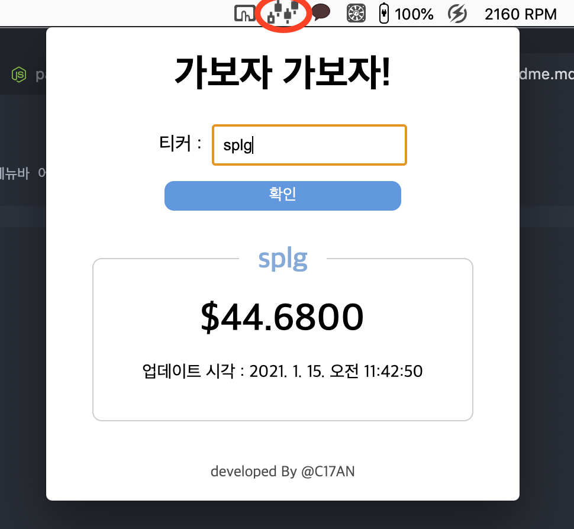

## 메뉴스탁

`Electron` 으로 제작한 ~~실시간~~ 주식 시세 검색 메뉴바 어플리케이션입니다.  
실시간 주식 api로 소개된 alphavantage 사의 intraday API를 사용했으나 이마저도 실시간이 아니었던 관계로 (--;) 종목별 이전일 종가만 확인이 가능한 상태입니다.  

API만 완벽했다면 성공적이었는데... 많은 아쉬움이 남는 결과물입니다.

### 커맨드 가이드

`npm run start` : 로컬에서 앱을 구동합니다. (상단바에 캔들 아이콘이 생성됩니다.)  
`npm run build` : 앱을 dmg / exe 파일 중 선택해 인스톨러를 빌드합니다.
